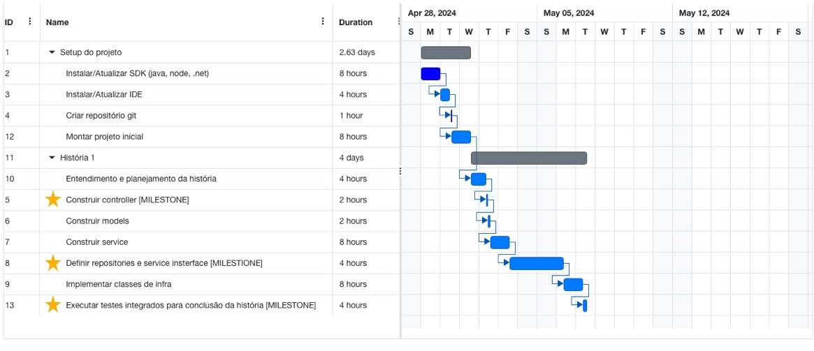
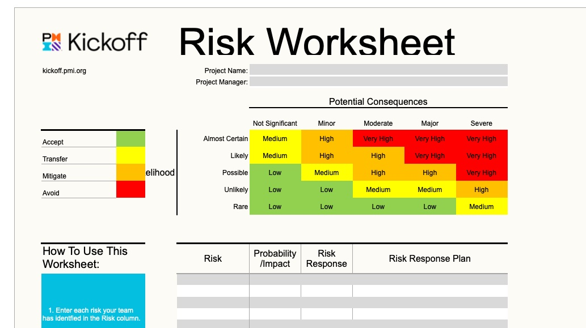

# Lab Desenvolvimento de Software 2024

## Planejamento do Projeto

### Visão Geral da Solução

Antes de iniciar o desenvolvimento deve-se elaborar e garantir que todos tenham conhecimento da visão geral da solução, seus módulos, interfaces e integrações.

### Arquitetura de Software

Deverá já ter definido o desenho conceitual que será adotado para o desenvolvimento. O entendimento do modelo deve estar claro para todo o time.

Caso houver necessidade de mais detalhes para entender o modelo, deverá ser disponibilizado diagramas auxiliares para enriquecer o entendimento.

## Planejamento e Controle do Ciclo de Desenvolvimento

Cada ciclo de desenvolvimento deverá ser planejado e acordado com todos as datas de término e devem ser definido milestones para que incrementos funcionais sejam entregues afim de dar subsídio para que tarefas dependentes possam ser programadas com antecedência.

### Planejamento do desenvolvedor

- Premissas
    - Deverá já ter definida a arquitetura do software no início do projeto
    - Deverá ter a definição de pronto para qualidade de código ANTES de iniciar o desenvolvimento
    - Desenho macro da solução já deverá ser fornecido e estar claro para todo o time
    - A arquitetura deve permitir a entrega do projeto em incrementos funcionais para que os milestones sejam alcançados

- O dev precisa minimamente se planejar antes de escrever código. Caso a história não disponibilize, deverá ser criado pelo menos:
    - **Diagrama de caso de uso**: ajuda no entendimento das regras e as interações com atores (aplicativos, arquétipos, api externas, etc)
    - **Diagrama de classes**: deverá complementar o digrama de classes já fornecido no início do projeto
    - Se a regra se mostrar complexa, lance mão da criação de **diagramas de interação** ou de **diagrama de sequência**. Esse dará respaldo para refinar a história junto ao product owner ou analista responsável pela definição das regras de negócio
    - Essa análise guiará o planejamento de esforço/prazo para implementação

- Entregável
    - Após análise o desenvolvedor deverá definir pelo menos **3 milestones** para o desenvolvimento da história:
        - Projeto rodando com a(s) controller(s) anotada(s) para gerar o Swagger
        - Repositories definidas e script para criação/alteração do banco de dados
        - Finalização da história e realização de teste integrado para liberar como concluída
    
    - Os milestones ajudarão planejar o início de atividades dependentes dessa história junto ao time ou times externos
    - O planejamento deverá ser entregue ao gerente do projeto ou scrum master para que esse possa acompanhar e integrar ao planejamento do projeto todo
    - Se a ferramenta de board/kanban não tiver essa funcionalidade, não houver acesso ao MS Project e não quiser fazer planilha, há alternativa online: https://www.onlinegantt.com
    - Para que seja possível o acompanhamento, deve-se diariamente reportar um percentual de progresso. Utilize a daily para reportar ou atualize o card na ferramenta de board/kanban (Jira, Trello, etc)

### Controle da gestão/liderança

### 1 - Acompanhamento do progresso

- Um gráfico de burndown pode ser gerado à partir do progresso reportado pelo time
    - Se a ferramenta utilizada para controlar o board/kanban não disponibilizar essa funcionalidade, pode ser usar templates como o disponibilizado pelo PMI [1]

### 2 - Acompanhamento dos riscos

- No início de cada ciclo de desenvolvimento deve-se tentar mapear riscos e acompanha-los para que não afetem o atingimento da meta do ciclo
    - Se a ferramenta utilizada para controlar o board/kanban não disponibilizar essa funcionalidade, pode ser usar templates como o disponibilizado pelo PMI [2]

## Auxílio na Estimativa

### Controller
> Atividades necessárias para definir um contrato para entrada e saída de dados dos endpoints da controller, implementação das DTO e ViewModels para atender os contratos e construção da lógica necessária para expor o endpoint funcionando retornando uma instância do objeto de retorno apenas para atender o caso de uso, portanto atender o teste unitário, desses endpoints.

### Models
> Atividades necessárias para desenvolvimento do código necessário para definir as classes que representam o modelo do contexto de negócio que a aplicação deve atender.

### Service
> Atividades necessárias para implementar as regras de negócios para atender os casos de uso definidos para a história, fazer a chamada da service pela controller e atender o teste de unidade dessa história.

### Repositories e Services Interfaces
> Atividades necessárias para persistência dos dados no banco de dados e implementação dos repositórios exigidos pela service.

### Implementação da infra
> Atividades necessárias para atender o desenvolvimento dos serviços externos à aplicação que são exigidos para atender os casos de uso da service.

## Referências
[1] Gráfico de burndown: https://kickoff.pmi.org/app/getting-the-work-done/measure-project-success/3

[2] Matriz de riscos: https://kickoff.pmi.org/app/planning-your-project-work/know-your-risks-and-create-mitigation-plans/3

[3] Ferramentas e templates para gestão: https://kickoff.pmi.org/app/tools-and-templates