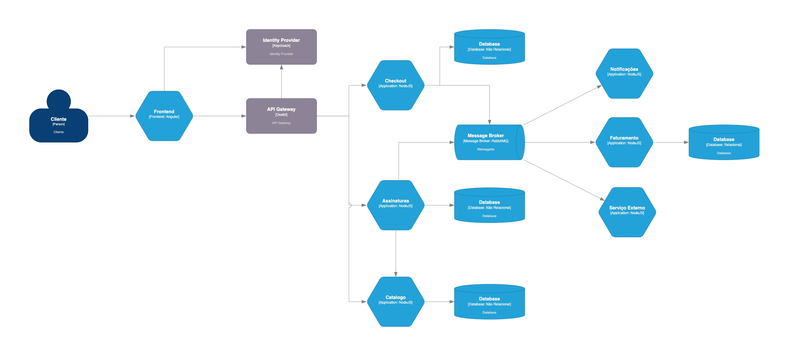

# Lab Arquitetura 2024

### Visão Geral da Solução

### Arquitetura de Software

## Auxílio na Estimativa

### Controller
> Atividades necessárias para definir um contrato para entrada e saída de dados dos endpoints da controller, implementação das DTO e ViewModels para atender os contratos e construção da lógica necessária para expor o endpoint funcionando retornando uma instância do objeto de retorno apenas para atender o caso de uso, portanto atender o teste unitário, desses endpoints.

### Models
> Atividades necessárias para desenvolvimento do código necessário para definir as classes que representam o modelo do contexto de negócio que a aplicação deve atender.

### Service
> Atividades necessárias para implementar as regras de negócios para atender os casos de uso definidos para a história, fazer a chamada da service pela controller e atender o teste de unidade dessa história.

### Repositories e Services Interfaces
> Atividades necessárias para persistência dos dados no banco de dados e implementação dos repositórios exigidos pela service.

### Implementação da infra
> Atividades necessárias para atender o desenvolvimento dos serviços externos à aplicação que são exigidos para atender os casos de uso da service.